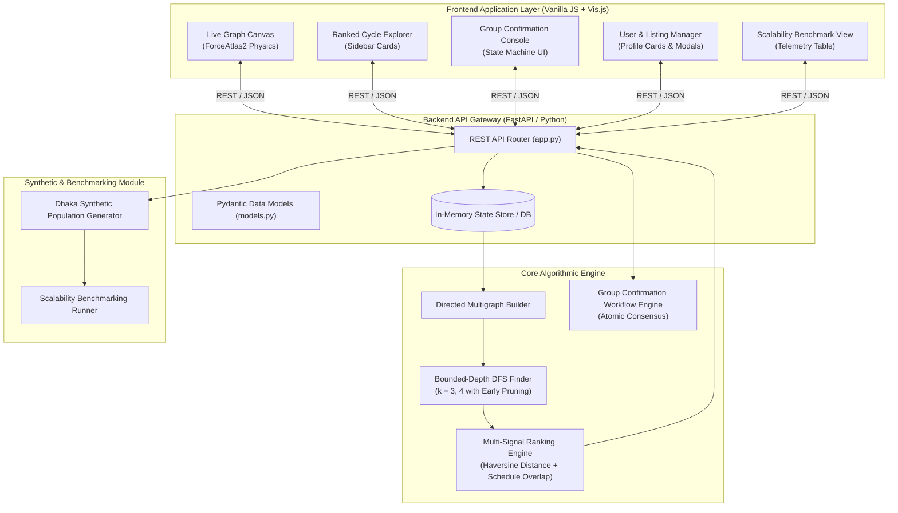
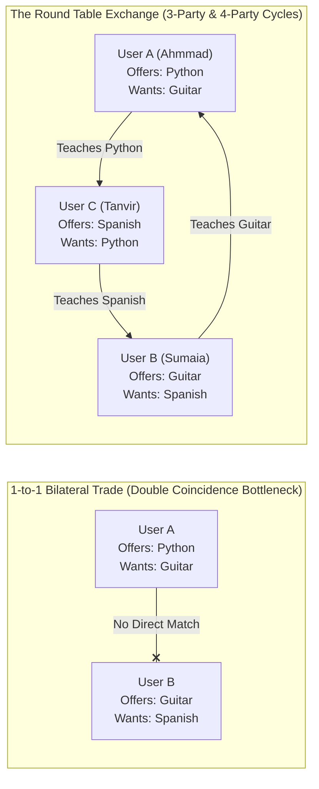
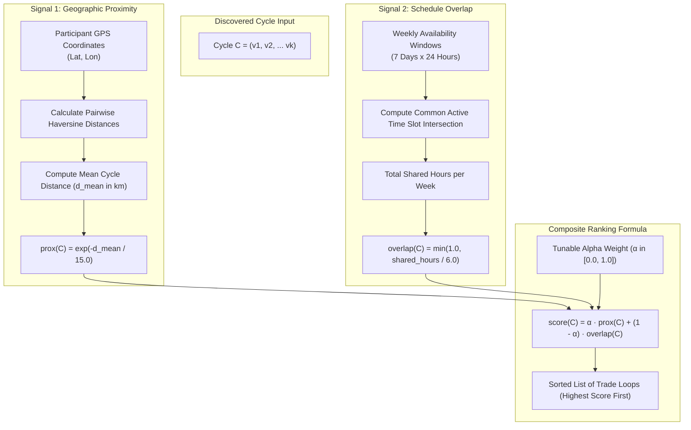
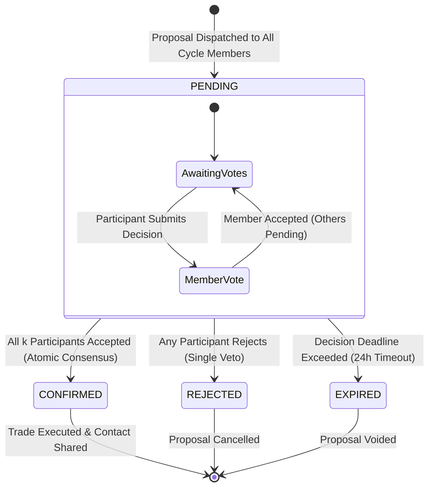
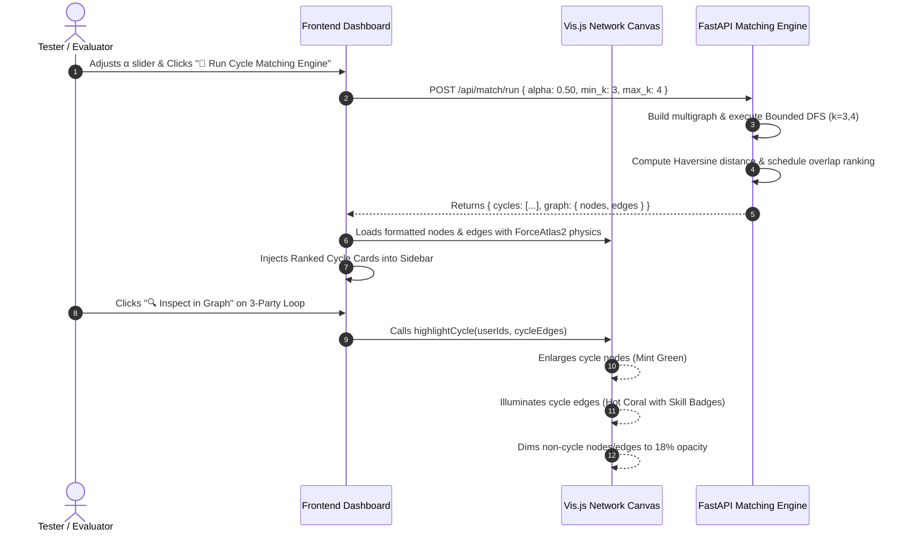
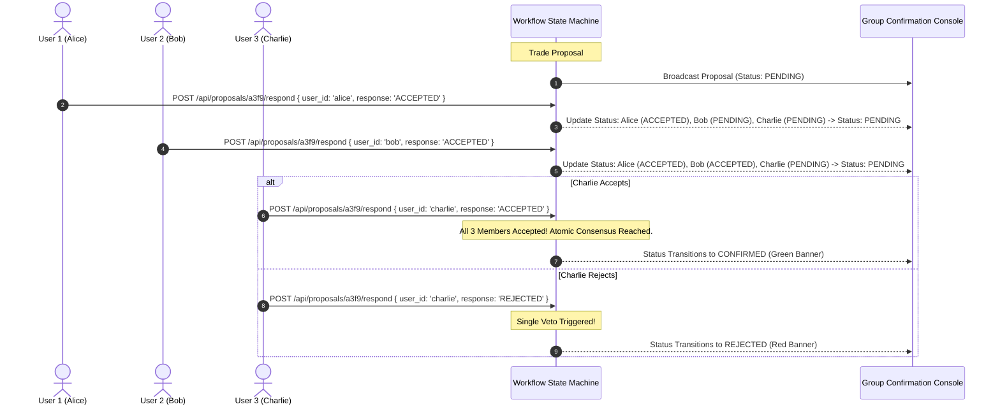
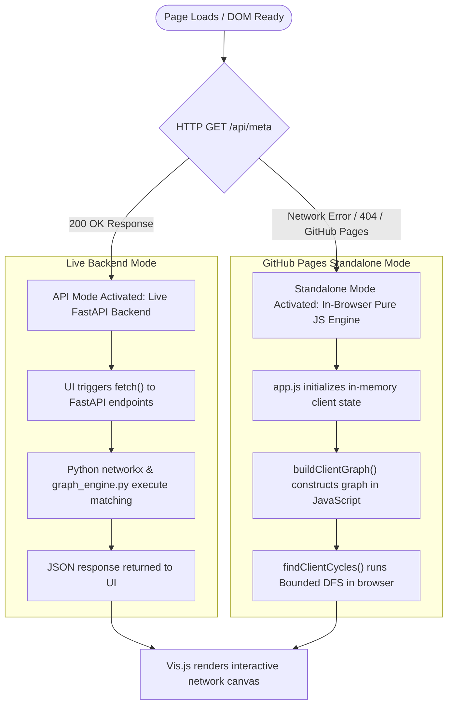
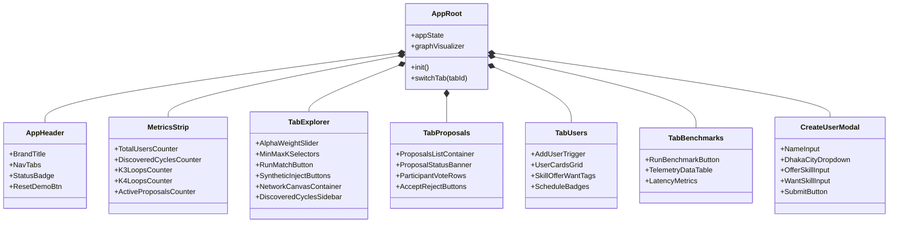

# 📊 DIAGRAMS.md — Complete Mermaid.js Diagrams for Draw.io

This document contains all architectural, algorithmic, workflow, and sequence diagrams for **The Round Table Exchange (RTE)**.

> ### 💡 How to use these in Draw.io:
> 1. Open **[draw.io](https://app.diagrams.net)** (or the Draw.io desktop app).
> 2. Click on the top menu: **`Arrange` $\rightarrow$ `Insert` $\rightarrow$ `Advanced` $\rightarrow$ `Mermaid`**.
> 3. Copy & paste any of the code blocks below into the text box and click **`Insert`**.

---

## 📑 Diagram Directory
1. [Diagram 1: End-to-End System Architecture & Data Flow](#diagram-1-end-to-end-system-architecture--data-flow)
2. [Diagram 2: Multi-Party Barter Loop vs Bilateral 1-to-1 Trade](#diagram-2-multi-party-barter-loop-vs-bilateral-1-to-1-trade)
3. [Diagram 3: Bounded-Depth DFS Cycle Detection Logic](#diagram-3-bounded-depth-dfs-cycle-detection-logic)
4. [Diagram 4: Multi-Signal Ranking Heuristic Engine](#diagram-4-multi-signal-ranking-heuristic-engine)
5. [Diagram 5: Group Confirmation State Machine](#diagram-5-group-confirmation-state-machine)
6. [Diagram 6: Cycle Discovery & Inspection Sequence](#diagram-6-cycle-discovery--inspection-sequence)
7. [Diagram 7: Atomic Multi-User Proposal Consensus Sequence](#diagram-7-atomic-multi-user-proposal-consensus-sequence)
8. [Diagram 8: Dual-Engine Client-Side vs API Execution Flow](#diagram-8-dual-engine-client-side-vs-api-execution-flow)
9. [Diagram 9: Frontend Component Hierarchy & UI Scaffolding](#diagram-9-frontend-component-hierarchy--ui-scaffolding)

---

## Diagram 1: End-to-End System Architecture & Data Flow



---

## Diagram 2: Multi-Party Barter Loop vs Bilateral 1-to-1 Trade



---

## Diagram 3: Bounded-Depth DFS Cycle Detection Logic

```mermaid
flowchart TD
    Start([Start Cycle Discovery]) --> InitSet[Initialize discovered_cycles = Set and max_cycles = 100]
    InitSet --> LoopNodes[Iterate each start_node in Graph G]
    
    LoopNodes --> CheckCap{discovered_cycles >= max_cycles?}
    CheckCap -- Yes --> End([Return Ranked Cycles])
    CheckCap -- No --> CallDFS[Call DFS path=[start_node], visited={start_node}]

    CallDFS --> CheckPathLen{Path Length > max_k?}
    CheckPathLen -- Yes --> Backtrack[Backtrack / Return]
    CheckPathLen -- No --> IterateNeighbors[Iterate Successors of current_node]

    IterateNeighbors --> CheckClosingEdge{Neighbor == start_node AND Path Length >= min_k?}
    CheckClosingEdge -- Yes --> Canonical[Normalize Cycle Rotation: Min Node ID First]
    Canonical --> AddCycle[Add to discovered_cycles Set]
    AddCycle --> CheckCap

    CheckClosingEdge -- No --> CheckValidNext{Neighbor not in visited AND Neighbor > start_node?}
    CheckValidNext -- Yes --> PushPath[Push neighbor to path & visited]
    PushPath --> RecurseDFS[Recursive DFS Visit]
    RecurseDFS --> PopPath[Pop neighbor from path & visited]
    PopPath --> IterateNeighbors
    CheckValidNext -- No --> IterateNeighbors
```

---

## Diagram 4: Multi-Signal Ranking Heuristic Engine



---

## Diagram 5: Group Confirmation State Machine



---

## Diagram 6: Cycle Discovery & Inspection Sequence



---

## Diagram 7: Atomic Multi-User Proposal Consensus Sequence



---

## Diagram 8: Dual-Engine Client-Side vs API Execution Flow



---

## Diagram 9: Frontend Component Hierarchy & UI Scaffolding


