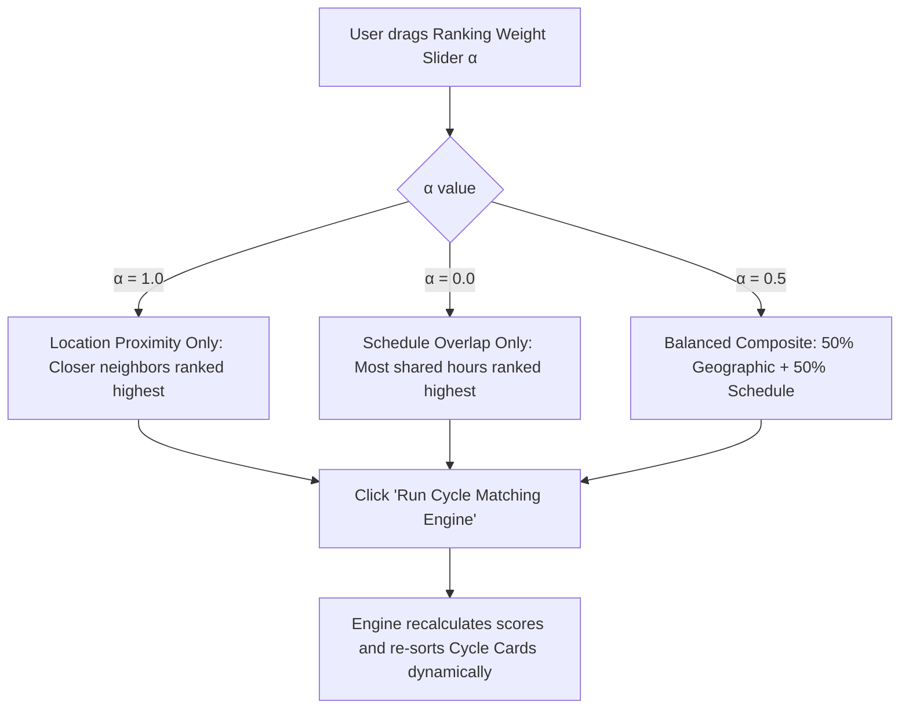
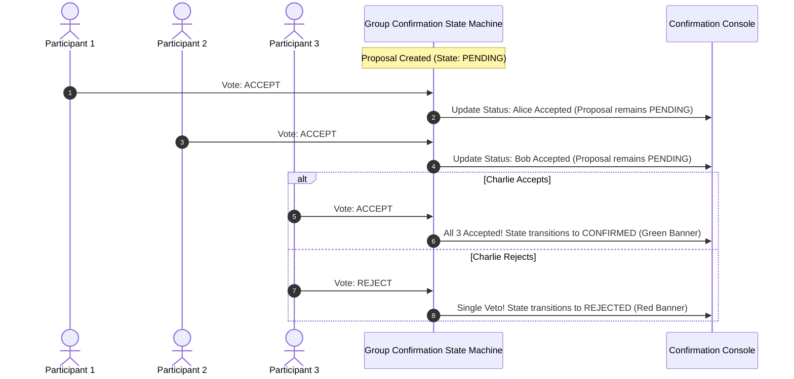
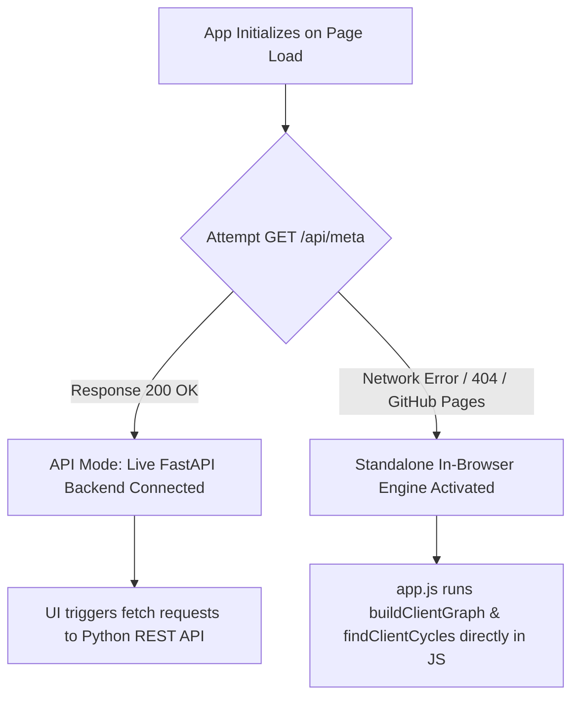

# 🎨 FRONTEND_SCAFFOLDING.md — Frontend Architecture, UI/UX Design & Interaction Blueprint

# The Round Table Exchange (RTE)
### *A Multi-Party Skill Barter Network with Graph-Based Cycle Matching*

---

## 📑 Table of Contents
1. [Executive Summary & Design Philosophy](#1-executive-summary--design-philosophy)
2. [Design System & Visual Tokens](#2-design-system--visual-tokens)
3. [Component Hierarchy & Application Scaffolding](#3-component-hierarchy--application-scaffolding)
4. [Workspace Views & Layout Scaffolding](#4-workspace-views--layout-scaffolding)
   - [4.1 Global Header & Live Metrics Strip](#41-global-header--live-metrics-strip)
   - [4.2 Tab 1: Network & Cycle Explorer (Main Workspace)](#42-tab-1-network--cycle-explorer-main-workspace)
   - [4.3 Tab 2: Group Confirmation Console](#43-tab-2-group-confirmation-console)
   - [4.4 Tab 3: User Directory & Listing Manager](#44-tab-3-user-directory--listing-manager)
   - [4.5 Tab 4: Empirical Scalability Benchmarks](#45-tab-4-empirical-scalability-benchmarks)
   - [4.6 User Creation & Listing Modal](#46-user-creation--listing-modal)
5. [User Interaction Flows & State Transitions](#5-user-interaction-flows--state-transitions)
   - [5.1 Cycle Discovery & Inspection Flow](#51-cycle-discovery--inspection-flow)
   - [5.2 Dynamic Ranking Parameter Tuning Flow](#52-dynamic-ranking-parameter-tuning-flow)
   - [5.3 Multi-Party Atomic Trade Confirmation Flow](#53-multi-party-atomic-trade-confirmation-flow)
   - [5.4 Synthetic Data Injection & Benchmarking Flow](#54-synthetic-data-injection--benchmarking-flow)
6. [Interactive Graph Visualization Canvas (Vis.js Mechanics)](#6-interactive-graph-visualization-canvas-visjs-mechanics)
7. [Frontend Code Structure & DOM Scaffolding](#7-frontend-code-structure--dom-scaffolding)
8. [Dual-Engine Execution Model (FastAPI vs In-Browser Engine)](#8-dual-engine-execution-model-fastapi-vs-in-browser-engine)
9. [Future Production Roadmap & Component Enhancements](#9-future-production-roadmap--component-enhancements)

---

## 1. Executive Summary & Design Philosophy

The frontend of **The Round Table Exchange (RTE)** is designed as an interactive, real-time algorithmic dashboard that bridges abstract graph-theoretic multi-party matching ($k=3, 4$ cycles) with intuitive, tactile consumer workflows.

### 🎨 Core Design Aesthetic: *Neo-Brutalist Cyber-Chic*
- **High-Contrast Editorial Typography**: Bold, punchy headings using `Space Grotesk`, paired with monospace telemetry counters in `JetBrains Mono`.
- **Vibrant Accent Palette**: High-voltage pop accents (`#FFE600` Canary Yellow, `#00F5D4` Electric Mint, `#FF0055` Neon Coral, `#D7B9FF` Soft Lavender) on an ink-black/cream background.
- **Tactile Micro-Interactions**: Chunky hard borders (`2px solid #121212`), crisp drop shadows with zero blur offset, and butter-smooth transitions.
- **Organic 60fps Network Canvas**: Living, floating particle physics graph visualizer where discovered trade loops light up dynamically in neon while irrelevant nodes dim into the background.

---

## 2. Design System & Visual Tokens

```css
/* Core Design Tokens */
:root {
  /* Surfaces & Backgrounds */
  --bg-canvas: #FFFDF5;            /* Warm Off-White / Cream Base */
  --bg-dark: #121212;              /* Deep Ink Black */
  --bg-card: #FFFFFF;              /* Pure White Card Surface */
  --bg-card-alt: #F4EFE6;          /* Muted Secondary Surface */

  /* Neo-Brutalist Borders & Shadows */
  --border-hard: 2px solid #121212;
  --border-thick: 3px solid #121212;
  --shadow-flat: 4px 4px 0px #121212;
  --shadow-flat-sm: 2px 2px 0px #121212;
  --shadow-flat-hover: 6px 6px 0px #121212;

  /* High-Voltage Accent Palette */
  --accent-yellow: #FFE600;        /* Primary Attention / Highlight */
  --accent-mint: #00F5D4;          /* Success / Active Loop Illuminate */
  --accent-coral: #FF0055;         /* Active Trade Path / Urgent Action */
  --accent-purple: #D7B9FF;        /* 4-Party Loop Tag */
  --accent-cyan: #00BBF9;          /* Informational / Secondary Tag */
  --accent-orange: #FF9E00;        /* Pending State Badge */

  /* Typography */
  --font-display: 'Space Grotesk', -apple-system, sans-serif;
  --font-mono: 'JetBrains Mono', monospace;
  --font-body: 'Space Grotesk', -apple-system, sans-serif;
}
```

---

## 3. Component Hierarchy & Application Scaffolding

```
<AppRoot>
├── <AppHeader>
│   ├── <BrandIdentity> (Logo + Title + Subtitle)
│   ├── <NavigationTabs> (4 Tab Buttons)
│   ├── <EngineStatusBadge> (Live DFS status indicator)
│   └── <ResetDemoButton> (Quick reset to canonical demo graph)
├── <MetricsStrip>
│   ├── <MetricCard: Total Users>
│   ├── <MetricCard: Discovered Cycles>
│   ├── <MetricCard: 3-Party Loops (k=3)>
│   ├── <MetricCard: 4-Party Loops (k=4)>
│   └── <MetricCard: Active Proposals>
├── <MainWorkspacesContainer>
│   ├── <Tab1: ExplorerWorkspace>
│   │   ├── <AlgorithmControlsPanel> (Alpha slider, min/max k, inject buttons)
│   │   ├── <GraphCanvasSection> (Vis.js interactive physics canvas + controls + legend)
│   │   └── <DiscoveredCyclesSidebar> (Ranked cycle cards + inspect/initiate actions)
│   ├── <Tab2: ProposalsWorkspace>
│   │   └── <ProposalsListContainer> (Multi-party state machine proposal cards + voting controls)
│   ├── <Tab3: UsersWorkspace>
│   │   ├── <UsersHeaderSection> (Filter + "Add User" trigger)
│   │   └── <UserCardsGrid> (Profile cards, skill tags, schedule chips)
│   └── <Tab4: BenchmarksWorkspace>
│       ├── <BenchmarkHeader> (Empirical complexity explanation)
│       ├── <RunBenchmarkButton>
│       └── <BenchmarkResultsTable> (Nodes vs Latency telemetry)
└── <CreateUserModal>
    └── <UserRegistrationForm> (Name, Dhaka location, offers, wants, schedule)
```

---

## 4. Workspace Views & Layout Scaffolding

### 4.1 Global Header & Live Metrics Strip
Located at the top of the interface across all views.

```
+---------------------------------------------------------------------------------------------------------+
| [🔄] The Round Table Exchange (RTE)   [🌐 Network Explorer] [🤝 Confirmations] [👥 Users] [⚡ Benchmarks]  [● DFS Active] [🔄 Reset] |
+---------------------------------------------------------------------------------------------------------+
| TOTAL USERS: 7  |  DISCOVERED CYCLES: 2  |  3-PARTY LOOPS: 1  |  4-PARTY LOOPS: 1  |  ACTIVE PROPOSALS: 0   |
+---------------------------------------------------------------------------------------------------------+
```

- **Brand Header**: Fixed sticky bar (`height: 68px`) with high z-index.
- **Nav Tabs**: Pill-shaped tactile toggle buttons with immediate active indicator feedback.
- **Metrics Strip**: 5-column responsive grid displaying real-time counters formatted in bold monospace digits.

---

### 4.2 Tab 1: Network & Cycle Explorer (Main Workspace)
A 3-column asymmetric layout designed for high-density algorithmic exploration:

```
+-------------------+----------------------------------------------------+--------------------------+
| ⚙️ ALGORITHM CTRL  | 🌐 INTERACTIVE NETWORK CANVAS                      | 🔁 DISCOVERED CYCLES     |
+-------------------+----------------------------------------------------+--------------------------+
| Ranking Alpha (α) | [🎯 Center View]  [✨ Reset Highlights]            | 2 Found                  |
| [===●===========] |                                                    +--------------------------+
| 0.50 (Balanced)   |          (User A) -----[Python]-----> (User B)      | [3-Party Loop]  [92.4%]  |
|                   |             ^                             |        | Alice ➔ Bob ➔ Charlie ➔  |
| Min/Max Loop (k): |             |                             |        | 📍 2.8 km  •  ⏰ 4.5h/wk  |
| [ 3 ] to [ 4 ]    |         [Spanish]                     [Guitar]     | [🔍 Inspect] [🤝 Propose]|
|                   |             |                             |        +--------------------------+
| [🚀 Run Match]    |             +------- (User C) <-----------+        | [4-Party Loop]  [84.1%]  |
|                   |                                                    | Nafisa ➔ Zubair ➔ Anika..|
| Synthetic Inject: |                                                    | 📍 4.1 km  •  ⏰ 3.0h/wk  |
| [+20]  [+50 Users]|  Legend: (● User Node) (-- Trade Link) (● Highlight)| [🔍 Inspect] [🤝 Propose]|
|                   |                                                    |                          |
| [➕ Add User]     |                                                    |                          |
+-------------------+----------------------------------------------------+--------------------------+
```

#### Left Column: Algorithm Controls Panel (`320px` width)
1. **$\alpha$ Ranking Weight Slider**: Interactively balances between Geographic Proximity ($\alpha=1.0$) and Schedule Overlap ($\alpha=0.0$).
2. **Cycle Length Bounds**: Dropdown selectors for $k_{\min}$ ($2$ or $3$) and $k_{\max}$ ($3$ or $4$).
3. **Execution Button**: High-visibility action button (`🚀 Run Cycle Matching Engine`) triggering graph rebuild & DFS traversal.
4. **Quick-Inject Buttons**: Single-click population injectors (`+20 Users`, `+50 Users`) for instant stress-testing.

#### Center Column: Interactive Graph Canvas (Fluid Width, min `600px` height)
1. **ForceAtlas2 Live Simulation**: Living organic physics graph with automatic node repulsion and edge attraction.
2. **Floating Viewport Controls**: `Center View` and `Reset Highlights` overlay buttons on top-left.
3. **Legend Overlay**: Explanatory color pins on bottom-left.

#### Right Column: Discovered Cycles Sidebar (`380px` width)
1. **Cycle Cards**: Vertically scrolling list of all closed loops found by the engine.
2. **Header Badges**: Tags distinguishing `3-Party Loop` (Indigo) from `4-Party Loop` (Purple), alongside composite match quality percentage score.
3. **Directed Trade Chain**: Step-by-step display of each member and the skill they transfer to their peer.
4. **Physical Telemetry**: Displays average geographic proximity in kilometers and weekly shared available hours.
5. **Card Action Triggers**:
   - **`🔍 Inspect in Graph`**: Isolates the loop in glowing neon in the canvas.
   - **`🤝 Initiate Proposal`**: Dispatches the trade proposal into the group confirmation state machine.

---

### 4.3 Tab 2: Group Confirmation Console
A focused interface for managing atomic multi-user trade proposals.

```
+-------------------------------------------------------------------------------------------------+
| 🤝 MULTI-PARTY TRADE CONFIRMATION STATE MACHINE                                                 |
+-------------------------------------------------------------------------------------------------+
| All participants in a discovered loop must accept for atomic trade confirmation.               |
|                                                                                                 |
| +---------------------------------------------------------------------------------------------+ |
| | PROPOSAL #a3f92b • 3-Party Loop (Python ➔ Guitar ➔ Spanish)          STATUS: ⏳ PENDING      | |
| +---------------------------------------------------------------------------------------------+ |
| | (Ahmmad Khan)   📍 Badda        Status: ✔ Accepted                                          | |
| | (Sumaia Ismail) 📍 Gulshan-2    Status: ⏳ Pending        [ ✔ Accept ]     [ ✖ Reject ]     | |
| | (Tanvir Ahmed)  📍 Banani       Status: ⏳ Pending        [ ✔ Accept ]     [ ✖ Reject ]     | |
| +---------------------------------------------------------------------------------------------+ |
+-------------------------------------------------------------------------------------------------+
```

- **Status Banners**: Color-coded banners reflecting proposal state (`PENDING` in Orange, `CONFIRMED` in Emerald Green, `REJECTED` in Coral Pink, `EXPIRED` in Gray).
- **Simulated Multi-User Voting Console**: Evaluator can click **`Accept`** or **`Reject`** as each participant to watch atomic state transitions live.

---

### 4.4 Tab 3: User Directory & Listing Manager
A card grid showcasing all active users, their neighborhood locations, weekly availability, and skills.

```
+-------------------------------------------------------------------------------------------------+
| REGISTERED USERS & SKILL LISTINGS                                       [ ➕ Add New User ]      |
+-------------------------------------------------------------------------------------------------+
| +-----------------------------+  +-----------------------------+  +---------------------------+ |
| | (A) Ahmmad Khan             |  | (S) Sumaia Ismail           |  | (T) Tanvir Ahmed          | |
| | 📍 Badda • ⏰ M/W/F (18-21) |  | 📍 Gulshan • ⏰ M/W/F (18-22)|  | 📍 Banani • ⏰ W/F/S(17-21) | |
| | [Teaches: Python]           |  | [Teaches: Acoustic Guitar]  |  | [Teaches: Spanish]        | |
| | [Wants: Acoustic Guitar]    |  | [Wants: Spanish]            |  | [Wants: Python]           | |
| +-----------------------------+  +-----------------------------+  +---------------------------+ |
+-------------------------------------------------------------------------------------------------+
```

---

### 4.5 Tab 4: Empirical Scalability Benchmarks
A telemetry table benchmarking graph construction and Bounded DFS cycle discovery across varying network densities.

```
+-------------------------------------------------------------------------------------------------+
| ⚡ EMPIRICAL SCALABILITY & COMPLEXITY BENCHMARKS (O(n · m^(k-1)))                                 |
| [ ▶ Run Scalability Benchmark (20 - 500 Nodes) ]                                                |
+-------------------------------------------------------------------------------------------------+
| GRAPH SIZE  | EDGE DENSITY | GRAPH BUILD TIME | CYCLE SEARCH (DFS) | TOTAL LATENCY | LOOPS FOUND |
| 20 users    | 60 edges     | 0.39 ms          | 1.20 ms            | 1.59 ms       | 26 loops    |
| 50 users    | 534 edges    | 2.25 ms          | 45.10 ms           | 47.35 ms      | 100 loops   |
| 100 users   | 1,280 edges  | 5.10 ms          | 82.40 ms           | 87.50 ms      | 100 loops   |
+-------------------------------------------------------------------------------------------------+
```

---

### 4.6 User Creation & Listing Modal
A clean modal overlay with backdrop blur:
- **Full Name**: Text input.
- **Location (Dhaka Area)**: Preset dropdown (Dhanmondi, Gulshan-2, Banani, Uttara, Mirpur, Mohammadpur, Bashundhara, Badda).
- **Skill Offered**: Skill the user wants to teach.
- **Skill Wanted**: Skill the user wants to learn.
- **Actions**: `Cancel` (dismiss modal) and `Create Profile` (submits and refreshes graph).

---

## 5. User Interaction Flows & State Transitions

### 5.1 Cycle Discovery & Inspection Flow

```mermaid
sequenceDiagram
    autonumber
    actor User as Tester / Evaluator
    participant UI as Frontend Dashboard
    participant Canvas as Vis.js Network
    participant Engine as Matching Engine (FastAPI / In-Browser)

    User->>UI: Adjusts α slider (e.g. 0.60) & clicks "Run Cycle Matching"
    UI->>Engine: POST /api/match/run { alpha: 0.60, min_k: 3, max_k: 4 }
    Engine-->>UI: Returns Discovered Cycles + Graph Nodes/Edges
    UI->>Canvas: Updates nodes & edges; starts ForceAtlas2 physics
    UI->>UI: Renders Ranked Cycle Cards in Sidebar
    
    User->>UI: Clicks "🔍 Inspect in Graph" on Cycle #1
    UI->>Canvas: Calls highlightCycle(userIds, cycleEdges)
    Canvas-->>Canvas: Enlarges cycle nodes (cyan/mint) & illuminates cycle edges (hot coral)
    Canvas-->>Canvas: Dims all unselected nodes & edges to 18% opacity
```

---

### 5.2 Dynamic Ranking Parameter Tuning Flow



---

### 5.3 Multi-Party Atomic Trade Confirmation Flow



---

## 6. Interactive Graph Visualization Canvas (Vis.js Mechanics)

The visual graph canvas in `frontend/js/graph_viz.js` is tuned for **buttery 60fps performance and organic floating drift**:

| Parameter | Configuration | Visual Impact |
|---|---|---|
| **Physics Solver** | `forceAtlas2Based` | Continuous organic graph layout |
| **Gravitational Constant** | `-26` | Gentle node repulsion preventing clutter |
| **Spring Length** | `125` | Natural edge spacing between users |
| **Damping** | `0.86` | Slow-motion graceful drift without erratic jitter |
| **Max Velocity** | `8.0` | Prevents sudden snaps or violent physics explosions |
| **Smooth Curve Type** | `continuous` | Silky curved cubic bezier trade arrows |
| **Shadows** | `false` | Canvas shadows disabled for zero-lag 60fps rendering |

### Dynamic Highlighting Algorithm
When `highlightCycle(cycleUserIds, cycleEdges)` is triggered:
1. **Participating Nodes**: Scaled up to radius `28px`, colored `#00F5D4` (Electric Mint), font set to bold `#121212`.
2. **Non-Participating Nodes**: Scaled down to `15px`, dimmed to `18%` opacity with muted gray border.
3. **Cycle Edges**: Width boosted to `4.0px`, colored `#FF0055` (Neon Coral), skill transfer text illuminated in bold yellow badges (`#FFE600`).
4. **Non-Cycle Edges**: Width reduced to `0.8px`, opacity dimmed to `10%`.

---

## 7. Frontend Code Structure & DOM Scaffolding

```
frontend/
├── index.html                 # Semantic Single-Page Dashboard layout
├── css/
│   └── style.css              # Neo-Brutalist design system & responsive styling
└── js/
    ├── app.js                 # UI State manager, REST client & In-Browser engine fallback
    └── graph_viz.js           # Vis.js physics controller & cycle illumination engine
```

### Key DOM Element IDs & Data Attributes
- `#alpha-slider`, `#alpha-val`: Ranking balance controls.
- `#min-k-select`, `#max-k-select`: Loop depth selectors.
- `#btn-run-match`: Main engine execution trigger.
- `#network-canvas`: Target DOM container for Vis.js canvas.
- `#cycles-list`: Sidebar container where cycle cards are dynamically injected.
- `#proposals-list`: Workspace container for confirmation state machine proposals.
- `#users-cards-grid`: Card grid container for registered profiles.
- `#benchmark-tbody`: Telemetry table body for scalability benchmarking.
- `#modal-create-user`: Registration modal dialog.

---

## 8. Dual-Engine Execution Model (FastAPI vs In-Browser Engine)

To enable zero-hassle deployment on GitHub Pages without requiring a hosted server, the frontend employs an **Automatic Dual-Engine Architecture**:



- **Feature Parity**: The standalone client engine supports the exact same Bounded DFS cycle detection ($k=3, 4$), ranking equations, group confirmation state machine, synthetic user injection, and benchmark suite as the Python backend.

---

## 9. Future Production Roadmap & Component Enhancements

For subsequent iterations beyond the semester MVP:
1. **React / Next.js Component Migration**: Modular componentization using Tailwind CSS or styled-components.
2. **Interactive Map View (Leaflet / Mapbox)**: Toggle between the force-directed abstract graph and a real Dhaka street map showing geodesic trade vectors.
3. **WebSocket Real-Time Notifications**: Live proposal alerts pushed to connected participant clients when a cycle is matched.
4. **Calendar Conflict Integration**: Visual timeline picker for drag-and-drop availability coordination.
