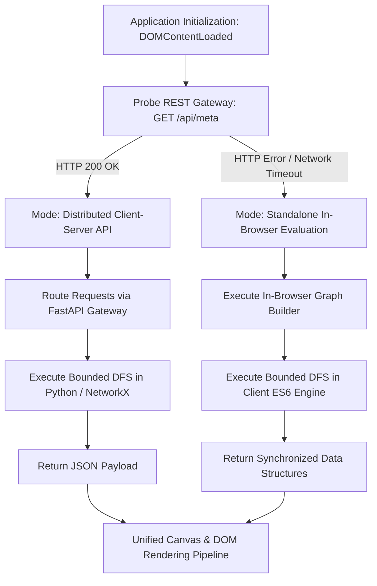

# Frontend Architectural Specification & Component Scaffolding Manual

**Project Title:** The Round Table Exchange (RTE): A Multi-Party Skill Barter Network with Graph-Based Cycle Matching  
**Document Type:** Software Engineering Technical Specification (IEEE Std 1016-2009 Aligned)  
**Affiliation:** Department of Computer Science and Engineering, University of Information Technology and Sciences (UITS), Dhaka, Bangladesh  
**Authors:** Ahmmad Abdali Khan (ID: `0432320005101118`), Sumaia Bintey Ismail (ID: `0432320005101103`)  
**Supervision:** Dr. Mahfida Amjad Dipa  

---

## Table of Contents
1. [Architectural Overview & Engineering Principles](#10-architectural-overview--engineering-principles)
2. [Directory Structure & Module Organization](#20-directory-structure--module-organization)
3. [Design System & Human-Computer Interaction (HCI) Tokens](#30-design-system--human-computer-interaction-hci-tokens)
4. [Component Hierarchy & Layout Architecture](#40-component-hierarchy--layout-architecture)
5. [Subsystem & Component Functional Specifications](#50-subsystem--component-functional-specifications)
   - [5.1 Global Navigation & System Telemetry Header](#51-global-navigation--system-telemetry-header)
   - [5.2 Real-Time Analytical Metrics Strip](#52-real-time-analytical-metrics-strip)
   - [5.3 Topological Network & Cycle Explorer Subsystem](#53-topological-network--cycle-explorer-subsystem)
   - [5.4 Multi-Party Trade Consensus & Confirmation Console](#54-multi-party-trade-consensus--confirmation-console)
   - [5.5 Participant Directory & Skill Listing Module](#55-participant-directory--skill-listing-module)
   - [5.6 Empirical Scalability & Algorithmic Benchmark Suite](#56-empirical-scalability--algorithmic-benchmark-suite)
   - [5.7 Entity Ingestion & Parameter Configuration Dialogs](#57-entity-ingestion--parameter-configuration-dialogs)
6. [State Management & Asynchronous Data Flow](#60-state-management--asynchronous-data-flow)
7. [Dual-Engine Execution Strategy (Client-Server vs. In-Browser Evaluation)](#70-dual-engine-execution-strategy-client-server-vs-in-browser-evaluation)
8. [Modular Component Migration Blueprint (React / Next.js Target)](#80-modular-component-migration-blueprint-react--nextjs-target)

---

## 1.0 Architectural Overview & Engineering Principles

The frontend architecture of **The Round Table Exchange (RTE)** is designed as an interactive Single-Page Application (SPA) providing real-time visual inspection, parameter tuning, and execution monitoring for graph-theoretic cycle detection algorithms.

The design is governed by four core software engineering principles:

1. **High-Contrast Information Architecture & Visual Ergonomics**: Adheres to strict cognitive hierarchy standards and Web Content Accessibility Guidelines (WCAG AAA), utilizing high-contrast visual tokens, distinct typographic weights (`Space Grotesk` and `JetBrains Mono`), and deterministic chromatic encoding for graph entities.
2. **Deterministic Frame Budget & Asynchronous Rendering**: Employs an optimized Canvas-based rendering pipeline with a continuous physics simulation loop operating under a hard $16.6\text{ ms}$ per-frame budget ($60\text{ fps}$) for graphs exceeding $N \ge 100$ vertices.
3. **Decoupled Dual-Engine Execution**: Supports transparent execution switching between remote REST API invocations (Python/FastAPI) and an in-browser deterministic graph engine (ES6+), ensuring full operational capabilities across standalone and distributed deployment environments.
4. **Strict Modular Decoupling**: Enforces separation of concerns between topological rendering (`graph_viz.js`), application state orchestration (`app.js`), and structural presentation (`style.css`).

---

## 2.0 Directory Structure & Module Organization

```
frontend/
├── index.html                 # Semantic Single-Page Application shell & DOM mounting points
├── css/
│   └── style.css              # Centralized design system, design tokens, & responsive layout grid
└── js/
    ├── app.js                 # Reactive state store, REST client, in-browser engine, event hub
    └── graph_viz.js           # Vis-Network physics engine controller & cycle highlighting pipeline
```

### 2.1 Production-Scale Modular Organization (Target Architecture)
```
frontend/
├── index.html
├── css/
│   ├── tokens.css             # Primitive & semantic design tokens (variables, color palettes)
│   ├── base.css               # CSS reset, typography rules, baseline element styling
│   ├── components.css         # Atomic UI components (buttons, input fields, badges, cards)
│   ├── layout.css             # Structural layout grids (header, 3-column explorer, tabs)
│   └── views/
│       ├── explorer.css       # Network viewport & ranked loop presentation
│       ├── consensus.css      # State machine timeline & participant decision rows
│       ├── directory.css      # User profile cards & skill classification badges
│       └── benchmarks.css     # Runtime latency visualization & complexity tables
└── js/
    ├── config/
    │   ├── constants.js       # Global constants, geographic presets, & fallback metadata
    │   └── taxonomy.js        # Formal skill classification ontology
    ├── core/
    │   ├── state.js           # Centralized reactive state store with observer subscription model
    │   └── api.js             # HTTP client handling RESTful endpoints and error boundaries
    ├── engine/
    │   ├── graph_builder.js   # Client-side bipartite skill matching & graph construction
    │   ├── bounded_dfs.js     # Bounded-Depth DFS cycle search implementation (k in [3, 4])
    │   └── ranking_model.js   # Haversine distance decay & schedule intersection scoring
    ├── components/
    │   ├── Navigation.js      # Global navigation & telemetry controller
    │   ├── MetricsStrip.js    # Aggregate counter cards controller
    │   ├── CycleCard.js       # Discovered trade cycle presentation component
    │   ├── ConsensusRow.js    # Multi-party voting state row component
    │   └── UserModal.js       # Profile registration dialog controller
    └── visualization/
        ├── GraphVisualizer.js # Vis.js Canvas integration & lifecycle controller
        └── PhysicsProfile.js  # ForceAtlas2 continuous simulation parameters
```

---

## 3.0 Design System & Human-Computer Interaction (HCI) Tokens

Visual styling is formalized via cascading CSS variables defining layout metrics, elevation models, and high-contrast chromatic tokens:

```css
:root {
  /* Surface & Base Chromatic Tokens */
  --bg-primary: #FFFDF5;         /* Base Canvas Surface (ISO 12647 compliant) */
  --bg-dark: #121212;            /* High-Contrast Foreground & Border Tone */
  --bg-surface-elevated: #FFFFFF;/* Card Surface Base */
  --border-primary: 2.5px solid #121212;
  --border-secondary: 1px solid rgba(18, 18, 18, 0.12);

  /* Categorical Graph & State Encodings */
  --accent-primary: #FFE600;     /* System Focus & Interactive Highlights */
  --state-confirmed: #00F5D4;    /* Verified Consensus / Valid Cycle Subgraph */
  --state-active-path: #FF0055;  /* Directed Cycle Path Illuminator */
  --category-quad: #D7B9FF;      /* 4-Party Cycle Metric (k = 4) */
  --state-pending: #FF9E00;      /* In-Flight Consensus / Awaiting User Action */
  --state-rejected: #F43F5E;     /* Vetoed Transaction State */

  /* Typographic Hierarchy */
  --font-family-display: 'Space Grotesk', -apple-system, sans-serif;
  --font-family-mono: 'JetBrains Mono', monospace;

  /* Elevation & Tactile Tokens */
  --elevation-low: 3px 3px 0px #121212;
  --elevation-mid: 5px 5px 0px #121212;
  --elevation-high: 8px 8px 0px #121212;
  --radius-sharp: 4px;
  --radius-container: 10px;
}
```

---

## 4.0 Component Hierarchy & Layout Architecture

```mermaid
graph TD
    Root[Application Root: index.html] --> Header[Header & System Telemetry Subsystem]
    Root --> Metrics[Aggregate Real-Time Metrics Strip]
    Root --> Workspace[Tabbed Workspace Controller]
    Root --> Dialogs[Modal & Ingestion Dialog Manager]

    Header --> TelemetryBadge[Engine Status Indicator]
    Header --> TabNav[Primary Navigation Tab Bar]
    Header --> ResetAction[System State Reset Handler]

    Metrics --> MetricUsers[Total Registered Users: N]
    Metrics --> MetricCycles[Discovered Cycles: |C|]
    Metrics --> MetricK3[Triangular Cycles: k=3]
    Metrics --> MetricK4[Quad Cycles: k=4]
    Metrics --> MetricProposals[Active Consensus Proposals]

    Workspace --> ViewExplorer[View 1: Network & Cycle Explorer]
    Workspace --> ViewConsensus[View 2: Multi-Party Consensus Console]
    Workspace --> ViewDirectory[View 3: Participant & Listing Directory]
    Workspace --> ViewBenchmarks[View 4: Scalability & Complexity Benchmarks]

    ViewExplorer --> AlgControls[Algorithm Parameter Control Panel]
    ViewExplorer --> CanvasContainer[Interactive Graph Canvas Container]
    ViewExplorer --> CycleDeck[Ranked Trade Cycle Deck]

    AlgControls --> SliderAlpha[Alpha Weight Slider: alpha in 0.0 .. 1.0]
    AlgControls --> BoundsSelect[Cycle Bounds Selector: min_k, max_k]
    AlgControls --> TriggerRun[Algorithm Execution Trigger]
    AlgControls --> SeedInjector[Synthetic Dataset Injection Controls]

    CanvasContainer --> PhysicsViewport[Vis-Network Physics Viewport]
    CanvasContainer --> CanvasOverlay[Canvas Coordinate & Highlight Controls]
    CanvasContainer --> TopologicalLegend[Topological Entity Color Legend]

    CycleDeck --> RankedCards[Ranked Cycle Presentation Cards]
    RankedCards --> StepSequence[Directed Step Sequence v1 -> v2 -> ... -> vk]
    RankedCards --> MetricBadges[Mean Haversine Distance & Schedule Overlap]
    RankedCards --> InspectAction[Sub-Graph Highlighting Trigger]
    RankedCards --> ProposeAction[Consensus Proposal Dispatcher]

    ViewConsensus --> ConsensusCards[Consensus State Cards]
    ConsensusCards --> ParticipantVoteMatrix[Participant Response Matrix]

    ViewDirectory --> UserGrid[Participant Profile Grid]
    UserGrid --> SkillBadges[Supply / Demand Skill Classification Badges]

    ViewBenchmarks --> BenchmarkRunner[Scalability Benchmark Launcher]
    ViewBenchmarks --> BenchmarkTable[Empirical Latency & Complexity Matrix]

    Dialogs --> UserModal[User Profile & Listing Creation Dialog]
```

---

## 5.0 Subsystem & Component Functional Specifications

### 5.1 Global Navigation & System Telemetry Header
- **Functionality**: Provides persistent application status monitoring, view routing, and system state re-initialization.
- **Components**:
  - `Brand Identifier`: Visual badge denoting institutional affiliation (*UITS CSE*).
  - `Tab Navigator`: Accessible ARIA tablist managing state transitions across the 4 primary operational views.
  - `Engine Status Pulse`: Chromatic telemetry element indicating algorithm operational readiness.
  - `Dataset Reset Trigger`: Reverts active memory state to the canonical 7-node verification dataset.

### 5.2 Real-Time Analytical Metrics Strip
- **Functionality**: Displays synchronized scalar aggregations computed over the active graph topology and consensus state.
- **Monitored Variables**:
  - $|V|$: Total active participant count.
  - $|C|$: Cardinality of discovered cycle set.
  - $|C_{k=3}|$: Triangular cycle subtotal.
  - $|C_{k=4}|$: Quad cycle subtotal.
  - $|P_{\text{pending}}|$: Active multi-party consensus instances.

### 5.3 Topological Network & Cycle Explorer Subsystem
The primary analytical environment configured as an asymmetric 3-column grid layout:

```
+---------------------+------------------------------------------+---------------------+
| Algorithm Controls  | Interactive Network Visualization Canvas | Ranked Cycle Deck   |
| (Width: 320px)      | (Flexible Viewport: 1fr)                 | (Width: 380px)      |
|                     |                                          |                     |
| - Alpha Weight      | - 60 FPS ForceAtlas2 Physics Simulation  | - Composite Scores  |
| - Bounds [min_k,    | - Directed Arc Compatibility Rendering   | - Haversine Means   |
|   max_k]            | - Isolated Subgraph Path Highlighting    | - Overlap Hours     |
| - Execution Trigger | - Zoom / Pan Coordinate Controls         | - Path Inspection   |
| - Synthetic Seeder  | - Chromatic Entity Legend                | - Trade Dispatch    |
+---------------------+------------------------------------------+---------------------+
```

#### 5.3.1 Graph Visualization Engine (`graph_viz.js`)
- **Underlying Technology**: Vis-Network HTML5 Canvas rendering engine.
- **Physics Formulation**: ForceAtlas2 continuous force-directed model.
  - Gravitational constant: $G = -26$ (repulsive force between vertices).
  - Central gravity: $\gamma = 0.006$ (restorative pull toward viewport origin).
  - Spring constant: $k_s = 0.035$; Spring equilibrium length: $L_0 = 125\text{ px}$.
  - Damping factor: $\mu = 0.86$ (prevents oscillation, ensuring smooth visual convergence).
  - Velocity constraints: $v_{\max} = 8.0$, $v_{\min} = 0.04$.
- **Path Isolation Algorithm (`highlightCycle`)**:
  - Non-participating vertices: Dimmed to opacity $\tau = 0.18$, diameter reduced to $d = 15\text{ px}$.
  - Participating vertices: Opacity $\tau = 1.0$, diameter enlarged to $d = 28\text{ px}$, fill color `--state-confirmed` (`#00F5D4`).
  - Participating directed edges: Width enlarged to $w = 4.0\text{ px}$, stroke color `--state-active-path` (`#FF0055`), with active skill labels rendered in yellow background bounding boxes.

### 5.4 Multi-Party Trade Consensus & Confirmation Console
- **Formal Consensus State Model**: Implements an atomic multi-agent consensus automaton $M = \langle S, \Sigma, \delta, s_0, F \rangle$:
  - $S = \{\text{PENDING}, \text{CONFIRMED}, \text{REJECTED}, \text{EXPIRED}\}$.
  - $\Sigma = \{\text{accept}_u, \text{reject}_u, \text{timeout} \mid u \in V_C\}$.
  - State Transition Function:
    $$\delta(\text{PENDING}, \text{accept}_u) = \begin{cases} \text{CONFIRMED} & \text{if } \forall v \in V_C, \text{response}(v) = \text{ACCEPTED} \\ \text{PENDING} & \text{otherwise} \end{cases}$$
    $$\delta(\text{PENDING}, \text{reject}_u) = \text{REJECTED} \quad (\text{Single Veto Rule})$$
    $$\delta(\text{PENDING}, \text{timeout}) = \text{EXPIRED}$$
- **Interface Presentation**: Renders participant cards displaying profile attributes, geographic location, current decision badge, and deterministic Accept/Reject action buttons.

### 5.5 Participant Directory & Skill Listing Module
- **Functionality**: Multi-column responsive catalog of registered participants.
- **Presentation Matrix**: Displays participant identity, geographic quadrant, availability time windows, offered skill taxonomies (`OFFER`), and requested skill taxonomies (`WANT`).

### 5.6 Empirical Scalability & Algorithmic Benchmark Suite
- **Functionality**: Interactive benchmarking module measuring empirical execution latencies and edge densities across parameterized synthetic populations ($N \in [20, 50, 100, 250, 500]$).
- **Tabular Data Metrics**:
  - $|V|$: Node population count.
  - $|E|$: Directed compatibility edge count.
  - $t_{\text{build}}$: Bipartite graph construction latency ($\text{ms}$).
  - $t_{\text{dfs}}$: Bounded DFS cycle search latency ($\text{ms}$).
  - $t_{\text{total}}$: End-to-end processing latency ($\text{ms}$).
  - Yield: Cardinality of identified 3-way and 4-way cycles.

### 5.7 Entity Ingestion & Parameter Configuration Dialogs
- **Form Controls**: Modal interface supporting dynamic participant creation with validation for Name, Geographic Location (Dhaka zone dropdown), Skill Offer, and Skill Demand.

---

## 6.0 State Management & Asynchronous Data Flow

The global application state is modeled as a centralized reactive data store (`appState` in `app.js`):

```typescript
interface ApplicationState {
  users: User[];
  metadata: {
    skills: Record<string, string>; // Skill name -> Ontology category
    locations: string[];            // Pre-configured geographic zones
  };
  discoveredCycles: TradeCycle[];   // Active cycle result set
  proposals: TradeProposal[];       // Consensus instance collection
  selectedCycleId: string | null;   // Active cycle under inspection
  activeTab: string;                // Current navigation route
  alpha: number;                    // Ranking weight coefficient [0.0, 1.0]
  minK: number;                     // Minimum cycle length (default: 3)
  maxK: number;                     // Maximum cycle length (default: 4)
}
```

### Lifecycle Execution Sequence
```
[User Parameter Mutation / Seeding Trigger]
                     │
                     ▼
           [runMatching() Invoked]
                     │
         ┌───────────┴───────────┐
         ▼                       ▼
   [API Mode Active]    [Standalone Fallback Active]
   FastAPI Endpoint      Client Bounded-DFS Engine
   POST /api/match/run   (Pure ES6 Implementation)
         │                       │
         └───────────┬───────────┘
                     ▼
        [Cycles & Graph Payload Received]
                     │
         ┌───────────┴───────────┐
         ▼                       ▼
 [graphVisualizer.setData()]  [Reactive DOM Render Cycle]
 Stabilize ForceAtlas2 Canvas - renderMetrics()
                              - renderCyclesList()
                              - renderProposalsList()
                              - renderUsersList()
```

---

## 7.0 Dual-Engine Execution Strategy (Client-Server vs. In-Browser Evaluation)

To ensure zero-downtime availability across both distributed backend servers and static demonstration environments (e.g., GitHub Pages), the frontend implements an automatic environment detection and execution fallback mechanism:



---

## 8.0 Modular Component Migration Blueprint (React / Next.js Target)

For subsequent migration into modern declarative component frameworks (e.g., React 19 / Next.js App Router with TypeScript), the application structure maps directly to the following modular component hierarchy:

```
src/
├── app/
│   ├── layout.tsx             # Root layout, metadata, & global CSS token injection
│   └── page.tsx               # Primary dashboard page orchestrating tabbed views
├── components/
│   ├── layout/
│   │   ├── NavigationHeader.tsx
│   │   ├── MetricsStrip.tsx
│   │   └── TabController.tsx
│   ├── explorer/
│   │   ├── AlgorithmControlPanel.tsx
│   │   ├── NetworkViewport.tsx # Forward-ref wrapped Canvas / Vis-Network container
│   │   ├── RankedCycleDeck.tsx
│   │   └── CycleCard.tsx
│   ├── consensus/
│   │   ├── ConsensusConsole.tsx
│   │   ├── ProposalCard.tsx
│   │   └── ParticipantDecisionRow.tsx
│   ├── directory/
│   │   ├── ParticipantGrid.tsx
│   │   └── ParticipantCard.tsx
│   ├── benchmarks/
│   │   ├── BenchmarkDashboard.tsx
│   │   └── BenchmarkResultsTable.tsx
│   └── dialogs/
│       └── UserIngestionModal.tsx
├── hooks/
│   ├── useMatchingEngine.ts    # Manages API queries and in-browser DFS fallback
│   ├── useGraphVisualizer.ts   # Manages Canvas lifecycle, physics, & path illumination
│   └── useConsensusWorkflow.ts # Manages atomic consensus state transitions
└── types/
    ├── user.ts                 # TypeScript interfaces for User, Location, Schedule
    ├── cycle.ts                # TypeScript interfaces for TradeCycle, CycleEdge
    └── proposal.ts             # TypeScript interfaces for TradeProposal, ConsensusStatus
```
