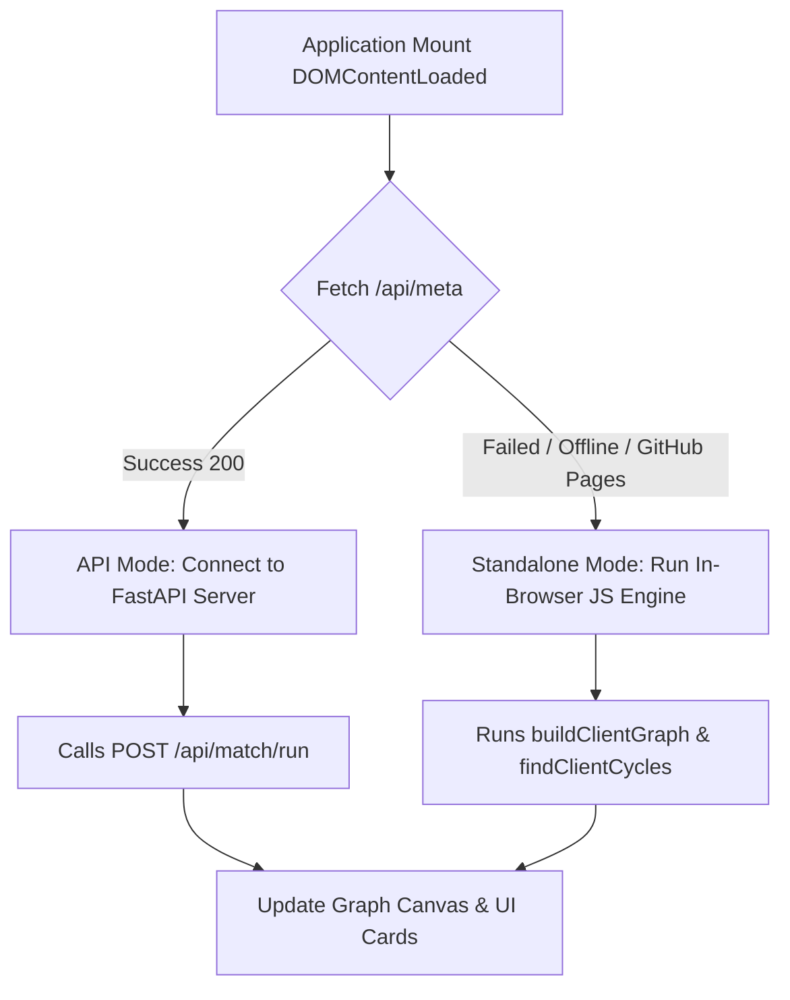

# 🎨 FRONTEND_SCAFFOLDING.md — Frontend Architecture & UI Component Blueprint

# The Round Table Exchange (RTE)
### *Frontend Scaffolding, Component Hierarchy, and UI/UX Specification*

---

## 📑 Table of Contents
1. [Overview & Architectural Philosophy](#1-overview--architectural-philosophy)
2. [Directory & File Structure Scaffolding](#2-directory--file-structure-scaffolding)
3. [Design System & Visual Tokens](#3-design-system--visual-tokens)
4. [Component Tree & Layout Architecture](#4-component-tree--layout-architecture)
5. [Detailed View & Component Breakdown](#5-detailed-view--component-breakdown)
   - [5.1 Global Header & Navigation](#51-global-header--navigation)
   - [5.2 Live Metrics Strip](#52-live-metrics-strip)
   - [5.3 Network & Cycle Explorer (Main Canvas & Panels)](#53-network--cycle-explorer-main-canvas--panels)
   - [5.4 Multi-Party Trade Confirmation Console](#54-multi-party-trade-confirmation-console)
   - [5.5 User Directory & Skill Listing Manager](#55-user-directory--skill-listing-manager)
   - [5.6 Empirical Scalability & Benchmark Sandbox](#56-empirical-scalability--benchmark-sandbox)
   - [5.7 Modals & Overlays](#57-modals--overlays)
6. [State Management & Data Flow Architecture](#6-state-management--data-flow-architecture)
7. [Dual-Engine Execution Strategy (API vs Standalone)](#7-dual-engine-execution-strategy-api-vs-standalone)
8. [React / Modern Framework Migration Blueprint](#8-react--modern-framework-migration-blueprint)

---

## 1. Overview & Architectural Philosophy

The Round Table Exchange (RTE) frontend is built with high visual fidelity, buttery performance, and algorithmic clarity:

1. **Neo-Brutalist & High-Contrast Cyber-Chic Aesthetic**: Punchy contrast, bold typography (`Space Grotesk`, `JetBrains Mono`), crisp borders, and curated neon accents (`#FFE600`, `#00F5D4`, `#FF0055`, `#D7B9FF`).
2. **Organic Physics & 60fps Network Rendering**: Physics-driven graph simulation providing living, organic float movements with zero frame drops.
3. **Zero-Dependency Dual-Mode Architecture**: Works seamlessly against a live FastAPI backend, while embedding an identical in-browser JavaScript engine for standalone GitHub Pages deployments.
4. **Component Decoupling**: Separation of graph visualization rendering (`graph_viz.js`), state/API management (`app.js`), and design token styles (`style.css`).

---

## 2. Directory & File Structure Scaffolding

```
frontend/
├── index.html                 # Semantic Single-Page Application (SPA) shell
├── css/
│   └── style.css              # Universal design system, CSS variables, & responsive grid
└── js/
    ├── app.js                 # State store, REST API client, in-browser engine, event hub
    └── graph_viz.js           # Vis.js physics controller, rendering pipeline & cycle highlighter
```

### Production / Scaled Directory Structure (for future modularization)
```
frontend/
├── index.html
├── assets/
│   ├── icons/                 # SVG icons (loop, users, bolt, check, cross)
│   └── images/                # UITS logo & system illustrations
├── css/
│   ├── variables.css          # Design tokens (colors, typography, radii, shadows)
│   ├── base.css               # Reset, typography, body layout
│   ├── components.css         # Buttons, cards, badges, inputs, sliders, modals
│   ├── layout.css             # Header, metrics bar, 3-column explorer grid, tabs
│   └── views/
│       ├── explorer.css       # Network canvas & cycle cards
│       ├── proposals.css      # State machine timeline & participant rows
│       ├── users.css          # User profile grid & skill tags
│       └── benchmarks.css     # Performance metrics & comparison tables
└── js/
    ├── config.js              # Constants, Dhaka GPS presets, skill taxonomy
    ├── state.js               # Central reactive state store & subscribers
    ├── api.js                 # REST client for FastAPI endpoints
    ├── engine/
    │   ├── graph_builder.js   # Client-side graph constructor
    │   ├── cycle_finder.js    # Bounded DFS cycle search algorithm
    │   └── ranking.js         # Haversine distance & schedule overlap scorer
    ├── components/
    │   ├── header.js          # Navigation & system status indicator
    │   ├── metrics_bar.js     # Top metrics counter cards
    │   ├── cycle_card.js      # Discovered loop presentation card
    │   ├── proposal_card.js   # Multi-user voting & state machine card
    │   └── user_modal.js      # User profile creation drawer/modal
    └── visualizer/
        ├── graph_viz.js       # Vis.js canvas manager
        └── physics_config.js  # ForceAtlas2 physics tuning parameters
```

---

## 3. Design System & Visual Tokens

```css
:root {
  /* Color Palette */
  --bg-primary: #FFFDF5;         /* Warm Paper Light */
  --bg-dark: #121212;            /* Deep Contrast Charcoal */
  --bg-card: #FFFFFF;            /* Pure Surface White */
  --border-thick: 2.5px solid #121212;
  --border-subtle: 1px solid rgba(18, 18, 18, 0.12);

  /* Vibrant Accent Palette */
  --accent-yellow: #FFE600;      /* Primary Punch */
  --accent-cyan: #00F5D4;        /* Success / Active Cycle */
  --accent-pink: #FF0055;        /* Highlight / Cycle Flow */
  --accent-purple: #D7B9FF;      /* Quad Cycle (k=4) */
  --accent-orange: #FF9E00;      /* Pending State */
  --accent-blue: #00BBF9;        /* User Avatar Accent */

  /* Typography */
  --font-display: 'Space Grotesk', -apple-system, sans-serif;
  --font-code: 'JetBrains Mono', monospace;

  /* Elevation & Shadows */
  --shadow-hard-sm: 3px 3px 0px #121212;
  --shadow-hard-md: 5px 5px 0px #121212;
  --shadow-hard-lg: 8px 8px 0px #121212;
  --radius-sharp: 4px;
  --radius-box: 10px;
}
```

---

## 4. Component Tree & Layout Architecture

```mermaid
graph TD
    App[Root Application: index.html]
    App --> Header[Global App Header]
    App --> Metrics[Live Metrics Strip]
    App --> Main[Tabbed Main View Container]
    
    Header --> Brand[Logo & Title Badge]
    Header --> Nav[Tab Navigation Buttons]
    Header --> EngineBadge[Live Status Pulse & Demo Reset]

    Metrics --> Metric1[Total Users]
    Metrics --> Metric2[Discovered Loops]
    Metrics --> Metric3[3-Party Loops k=3]
    Metrics --> Metric4[4-Party Loops k=4]
    Metrics --> Metric5[Active Proposals]

    Main --> Tab1[Tab: Network & Cycle Explorer]
    Main --> Tab2[Tab: Trade Confirmations Console]
    Main --> Tab3[Tab: User Profiles & Directory]
    Main --> Tab4[Tab: Scalability Benchmarks]

    Tab1 --> LeftPanel[Algorithm Control Panel]
    Tab1 --> CenterCanvas[Interactive Graph Canvas Vis.js]
    Tab1 --> RightPanel[Discovered Cycles List]

    LeftPanel --> AlphaSlider[Alpha Weight Slider 0.0 - 1.0]
    LeftPanel --> BoundsSelect[Min/Max Cycle Bounds k=3, 4]
    LeftPanel --> RunMatchBtn[Run Matching Engine Button]
    LeftPanel --> SynthInject[Quick Synthetic Injectors +20, +50]
    LeftPanel --> AddUserBtn[Add User Profile Trigger]

    CenterCanvas --> GraphToolbar[Center / Reset Highlight Controls]
    CenterCanvas --> GraphLegend[Color Legend & Node Keys]
    CenterCanvas --> CanvasDOM[Vis-Network Physics Viewport]

    RightPanel --> CycleCountBadge[Active Found Counter]
    RightPanel --> CycleCards[Dynamic Ranked Cycle Cards]

    Tab2 --> ProposalsList[Active Proposal Cards]
    ProposalsList --> MemberVotes[Member Avatar, Status & Accept/Reject Buttons]

    Tab3 --> UsersGrid[User Profile Cards Grid]
    UsersGrid --> SkillPills[Offered & Wanted Skill Badges]

    Tab4 --> BenchHeader[Benchmark Launcher]
    Tab4 --> BenchTable[Real-time Latency & Edge Complexity Table]

    App --> ModalUser[Create User Profile Modal Dialog]
```



---

## 5. Detailed View & Component Breakdown

### 5.1 Global Header & Navigation
- **Location**: Top of viewport (sticky, `z-index: 100`).
- **Elements**:
  - `Brand Icon & Title`: RTE logo, project title, and institution affiliation (`UITS CSE`).
  - `Tab Navigator`: 4 interactive toggle buttons with icons (`🌐 Explorer`, `🤝 Confirmations`, `👥 Users`, `⚡ Benchmarks`).
  - `System Pulse`: Green glowing badge indicating matching engine readiness.
  - `Quick Reset`: Button to restore the canonical 7-user test scenario.

### 5.2 Live Metrics Strip
- **Grid Layout**: 5 responsive metric cards displaying real-time counters:
  - Total Active Users
  - Total Discovered Barter Loops
  - 3-Way Loops ($k=3$)
  - 4-Way Loops ($k=4$)
  - Active Pending Proposals

### 5.3 Network & Cycle Explorer (Main Canvas & Panels)
The core interactive workbench featuring a **3-column dashboard grid**:

```
+-------------------+------------------------------------+--------------------+
| ⚙️ Controls (320px)| 🌐 Interactive Network Graph Canvas | 🔁 Cycles (380px)  |
|                   |                                    |                    |
| - Alpha Slider    | - Force-directed 60fps graph       | - Ranked Loops     |
| - Min/Max k bounds| - Highlighted cycle loop in Pink   | - Score Percentage |
| - Run Algorithm   | - Hover tooltips & skill arrows    | - Distance & Hours |
| - Synthetic +20/50| - Toolbar (Center, Reset)          | - Inspect & Trade  |
| - Add User Profile| - Legend                           |   Action Buttons   |
+-------------------+------------------------------------+--------------------+
```

#### Graph Interaction Specifications (`graph_viz.js`):
- **Node Representation**: Circular avatars colored by user category, with black high-contrast borders and bold typography.
- **Edge Representation**: Smooth curved directional arrows labeled with skill names.
- **Cycle Isolation (`highlightCycle`)**:
  - Unrelated nodes are dimmed to $18\%$ opacity.
  - Participating nodes expand from $15\text{px}$ to $28\text{px}$ in glowing turquoise (`#00F5D4`).
  - Participating edges turn into thick $4\text{px}$ neon pink lines (`#FF0055`) with skill labels highlighted in yellow boxes.

### 5.4 Multi-Party Trade Confirmation Console
- **Layout**: Centered timeline and proposal cards.
- **Card Structure**:
  - **Status Banner**: Color-coded pill (`PENDING` in amber, `CONFIRMED` in emerald, `REJECTED` in rose).
  - **Loop Topology**: Graphical summary of the multi-person chain ($A \to B \to C \to A$).
  - **Participant Decision Matrix**: Row for each participant with avatar, name, location, current decision badge (`⏳ Pending`, `✔ Accepted`, `✖ Rejected`), and individual **Accept** / **Reject** action buttons.
  - **Atomic Rule**: Displays notice that 100% unanimous acceptance is required for final execution.

### 5.5 User Directory & Skill Listing Manager
- **Layout**: Responsive multi-column grid of user cards.
- **Card Content**:
  - Avatar initial with unique background color.
  - Full name, neighborhood/city badge, availability schedule (e.g. `Mon, Wed, Fri (18:00 - 21:00)`).
  - **Offered Skills Group**: Emerald pills displaying skills the user can teach.
  - **Wanted Skills Group**: Indigo/Purple pills displaying skills the user wants to learn.

### 5.6 Empirical Scalability & Benchmark Sandbox
- **Controls**: "Run Scalability Benchmark" action button.
- **Data Table Columns**:
  1. `Graph Size` ($N = 20, 50, 100, 250, 500$ nodes)
  2. `Edge Density` (Number of directional skill compatibility edges)
  3. `Graph Construction Latency` (ms)
  4. `DFS Cycle Detection Latency` (ms)
  5. `Total Latency` (ms)
  6. `Discovered Loops Breakdown` (Number of 3-party vs 4-party loops)

### 5.7 Modals & Overlays
- **`Create User Modal`**:
  - Input fields: Full Name, Neighborhood (dropdown with 8 Dhaka locations), Skill Offered, Skill Wanted.
  - Form submission hooks into both the backend API and the in-browser state store.

---

## 6. State Management & Data Flow Architecture

```javascript
// Central Application State Schema (appState in app.js)
{
  users: Array<User>,                // List of registered user objects
  metadata: {
    skills: Record<string, string>,  // Skill name -> Category mapping
    locations: Array<string>         // Pre-configured Dhaka locations
  },
  discoveredCycles: Array<TradeCycle>, // Currently detected cycles
  proposals: Array<TradeProposal>,   // Active and historical proposals
  selectedCycleId: string | null,    // Currently inspected cycle ID
  activeTab: string,                 // 'tab-explorer' | 'tab-proposals' | 'tab-users' | 'tab-benchmarks'
  alpha: number,                     // Weight parameter (0.0 to 1.0)
  minK: number,                      // Minimum cycle length (default: 3)
  maxK: number                       // Maximum cycle length (default: 4)
}
```

### Event & Data Flow Lifecycle:
1. **User Action** (e.g., slider change, new user added, or synthetic generation trigger).
2. **Matching Engine Trigger**: `runMatching()` queries backend or executes in-browser DFS.
3. **Graph Sync**: `graphVisualizer.setData()` re-stabilizes nodes and edges on the canvas.
4. **Reactive Render**: `renderMetrics()`, `renderCyclesList()`, and `renderUsersList()` refresh DOM nodes.

---

## 7. Dual-Engine Execution Strategy (API vs Standalone)



---

## 8. React / Modern Framework Migration Blueprint

If migrating this scaffolding to **React (Next.js / Vite)**:

```
src/
├── components/
│   ├── layout/
│   │   ├── Header.tsx
│   │   ├── MetricsStrip.tsx
│   │   └── TabNavigation.tsx
│   ├── explorer/
│   │   ├── AlgorithmControls.tsx
│   │   ├── NetworkCanvas.tsx       # Ref-wrapped Vis.js or React-Flow container
│   │   └── CycleList.tsx
│   ├── proposals/
│   │   ├── ProposalList.tsx
│   │   └── ParticipantVoteRow.tsx
│   ├── users/
│   │   ├── UserCard.tsx
│   │   └── CreateUserModal.tsx
│   └── benchmark/
│       └── BenchmarkTable.tsx
├── hooks/
│   ├── useMatchingEngine.ts        # Encapsulates API calls & DFS fallback
│   ├── useGraphVisualizer.ts       # Physics lifecycle & highlight handlers
│   └── useProposalWorkflow.ts      # State machine mutations
├── types/
│   └── index.ts                    # TypeScript definitions for User, Cycle, Proposal
└── styles/
    └── globals.css
```
