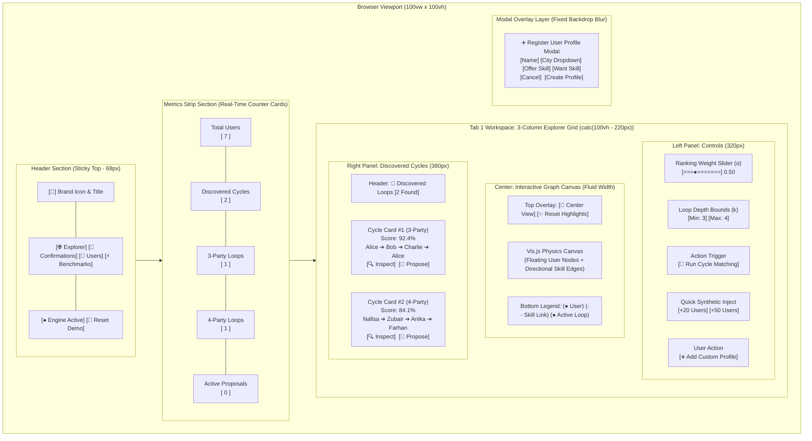
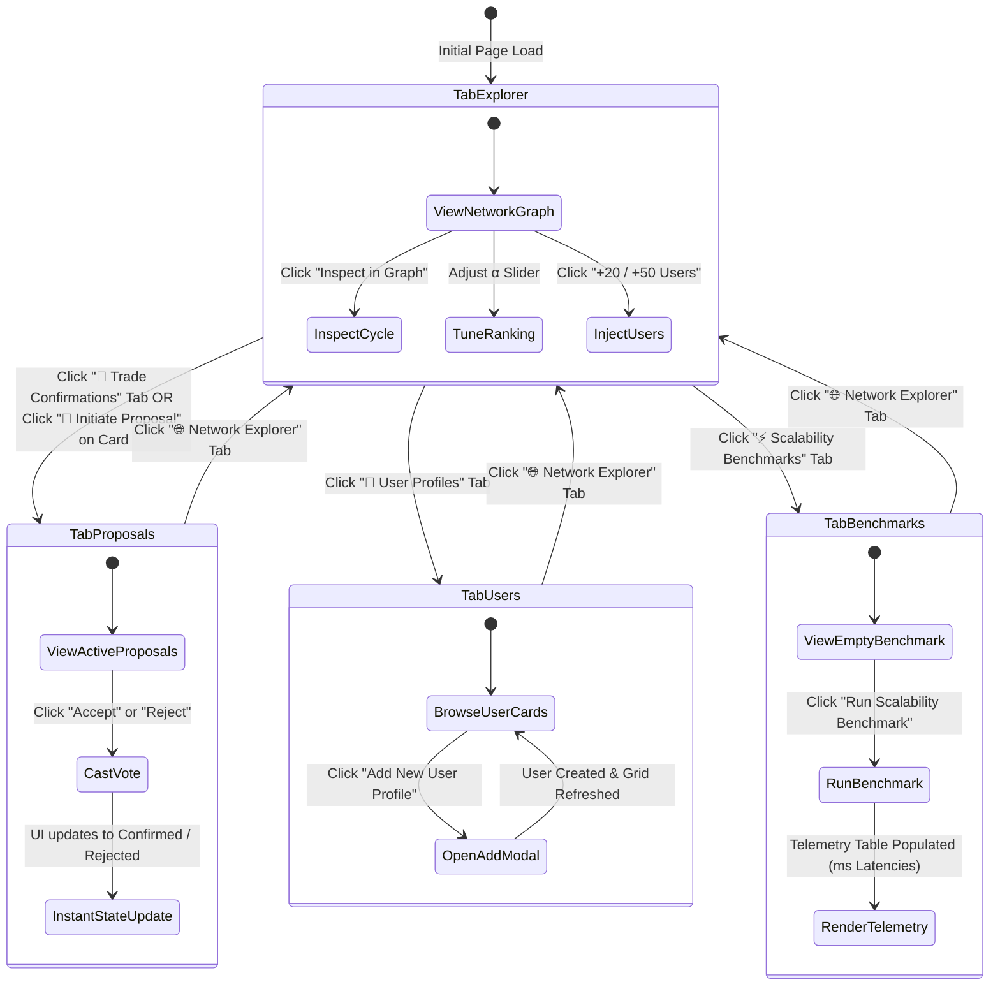
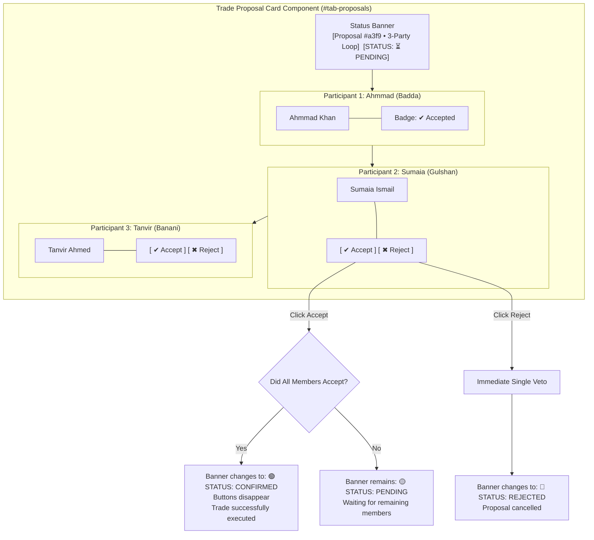
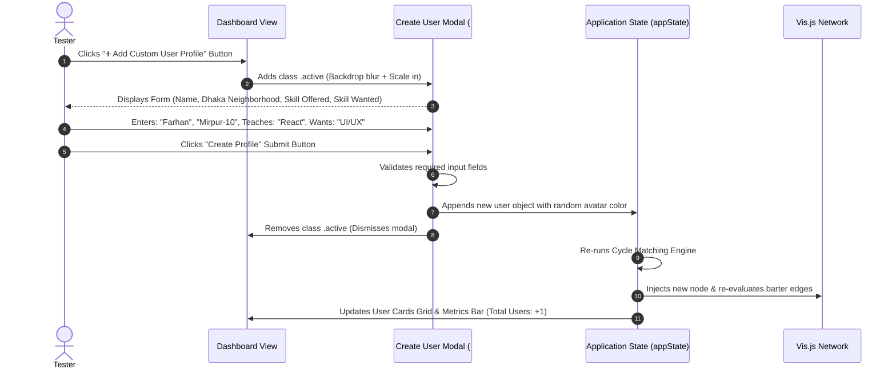

# 🎨 FRONTEND_UI_DIAGRAMS.md — Frontend UI/UX Scaffolding Diagrams (Draw.io Mermaid.js)

This document contains **strictly Frontend UI/UX Scaffolding Diagrams**, visual wireframes, component hierarchies, user interaction flows, and screen state transitions for Draw.io.

> ### 💡 How to use in Draw.io:
> 1. Open **[draw.io](https://app.diagrams.net)**.
> 2. Click: **`Arrange` $\rightarrow$ `Insert` $\rightarrow$ `Advanced` $\rightarrow$ `Mermaid`**.
> 3. Copy & paste any diagram block below into the box and click **`Insert`**.

---

## 📑 Frontend Diagrams Directory
1. [Diagram 1: Screen Layout & Wireframe Grid Scaffolding](#diagram-1-screen-layout--wireframe-grid-scaffolding)
2. [Diagram 2: Frontend Component Tree & UI Hierarchy](#diagram-2-frontend-component-tree--ui-hierarchy)
3. [Diagram 3: Navigation & Tab Switching UX State Flow](#diagram-3-navigation--tab-switching-ux-state-flow)
4. [Diagram 4: Interactive Graph Visualizer UI States & Highlighting](#diagram-4-interactive-graph-visualizer-ui-states--highlighting)
5. [Diagram 5: Group Confirmation Console UI & Voting States](#diagram-5-group-confirmation-console-ui--voting-states)
6. [Diagram 6: User Registration Modal UX Flow](#diagram-6-user-registration-modal-ux-flow)

---

## Diagram 1: Screen Layout & Wireframe Grid Scaffolding
*Visual layout mapping of all interface sections, control panels, interactive canvas, and sidebar feeds.*



---

## Diagram 2: Frontend Component Tree & UI Hierarchy
*Component structure representing DOM nodes, template containers, and UI widgets.*

```mermaid
graph TD
    App["<AppRoot> (#app)"]
    
    Header["<Header.app-header>"]
    Brand["<BrandWrapper>"]
    Nav["<NavTabs.nav-tabs>"]
    StatusBadge["<EngineBadge.badge>"]
    ResetBtn["<Button#btn-reset-demo>"]

    Metrics["<Section.metrics-strip>"]
    MCard1["<MetricCard: Users>"]
    MCard2["<MetricCard: Cycles>"]
    MCard3["<MetricCard: K3>"]
    MCard4["<MetricCard: K4>"]
    MCard5["<MetricCard: Proposals>"]

    Main["<Main.app-main>"]
    Tab1["<TabContent#tab-explorer> (Active)"]
    Tab2["<TabContent#tab-proposals>"]
    Tab3["<TabContent#tab-users>"]
    Tab4["<TabContent#tab-benchmarks>"]

    %% Tab 1 Subcomponents
    Grid1["<Grid.explorer-grid>"]
    PanelCtrl["<Panel: Algorithm Controls>"]
    SliderAlpha["<Slider#alpha-slider>"]
    SelectK["<Select#min-k-select / #max-k-select>"]
    BtnMatch["<Button#btn-run-match>"]

    CanvasContainer["<Section.graph-container>"]
    VisCanvas["<Div#network-canvas>"]
    ControlsOverlay["<Div.graph-overlay-controls>"]
    LegendOverlay["<Div.graph-legend>"]

    PanelCycles["<Panel: Discovered Cycles>"]
    CyclesList["<Div#cycles-list>"]
    CycleCard["<Div.cycle-card>"]
    BtnInspect["<Button.btn-view-cycle>"]
    BtnPropose["<Button.btn-initiate-trade>"]

    %% Tab 2 Subcomponents
    ProposalsList["<Div#proposals-list>"]
    ProposalBox["<Div.proposal-box>"]
    VoteRow["<Div.participant-vote-row>"]
    BtnVote["<Button.btn-vote (Accept/Reject)>"]

    %% Modal
    Modal["<Modal#modal-create-user>"]
    FormUser["<Form#form-create-user>"]

    App --> Header
    App --> Metrics
    App --> Main
    App --> Modal

    Header --> Brand
    Header --> Nav
    Header --> StatusBadge
    Header --> ResetBtn

    Metrics --> MCard1
    Metrics --> MCard2
    Metrics --> MCard3
    Metrics --> MCard4
    Metrics --> MCard5

    Main --> Tab1
    Main --> Tab2
    Main --> Tab3
    Main --> Tab4

    Tab1 --> Grid1
    Grid1 --> PanelCtrl
    Grid1 --> CanvasContainer
    Grid1 --> PanelCycles

    PanelCtrl --> SliderAlpha
    PanelCtrl --> SelectK
    PanelCtrl --> BtnMatch

    CanvasContainer --> VisCanvas
    CanvasContainer --> ControlsOverlay
    CanvasContainer --> LegendOverlay

    PanelCycles --> CyclesList
    CyclesList --> CycleCard
    CycleCard --> BtnInspect
    CycleCard --> BtnPropose

    Tab2 --> ProposalsList
    ProposalsList --> ProposalBox
    ProposalBox --> VoteRow
    VoteRow --> BtnVote

    Modal --> FormUser
```



---

## Diagram 3: Navigation & Tab Switching UX State Flow
*User navigation flow across the 4 main workspaces.*



---

## Diagram 4: Interactive Graph Visualizer UI States & Highlighting
*Visual states of the ForceAtlas2 physics canvas and cycle illumination mechanism.*

```mermaid
stateDiagram-v2
    [*] --> LivingOrganicFloat: Graph Rendered (ForceAtlas2 Physics)

    state LivingOrganicFloat {
        note right of LivingOrganicFloat: All nodes colored with pop palette\nEdges at 45% opacity\nGraceful continuous drift
    }

    LivingOrganicFloat --> NodeHoverState: Mouse hovers over User Node
    state NodeHoverState {
        note right of NodeHoverState: Tooltip displays: Name, City, Offered Skills, Wanted Skills\nNode borders glow #FFE600 (Yellow)
    }
    NodeHoverState --> LivingOrganicFloat: Mouse leaves node

    LivingOrganicFloat --> CycleHighlightedState: User clicks "Inspect in Graph" on a Cycle Card
    state CycleHighlightedState {
        note right of CycleHighlightedState: Cycle Nodes: Scale up (28px), turn #00F5D4 (Electric Mint)\nCycle Edges: Width 4.0px, #FF0055 (Neon Coral), Yellow Skill Badges\nNon-Cycle Nodes & Edges: Dimmed to 18% opacity
    }

    CycleHighlightedState --> CycleHighlightedState: User selects another Cycle Card
    CycleHighlightedState --> LivingOrganicFloat: User clicks "✨ Reset Highlights"
    CycleHighlightedState --> LivingOrganicFloat: User clicks "🎯 Center View"
```

---

## Diagram 5: Group Confirmation Console UI & Voting States
*Atomic multi-user voting card states in Tab 2.*



---

## Diagram 6: User Registration Modal UX Flow
*Dialog opening, form validation, and instant state update flow.*


