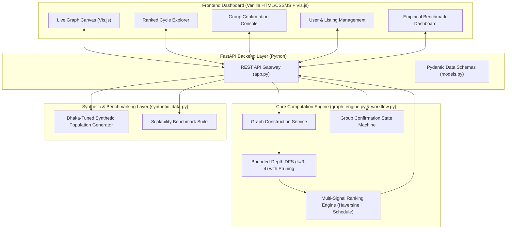
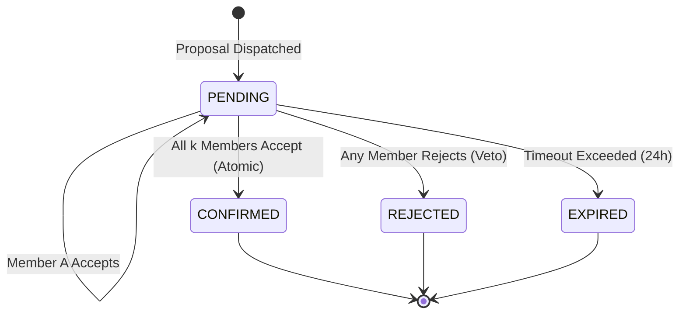

# 📘 PROJECT.md — Technical Specification & Comprehensive Documentation

# The Round Table Exchange (RTE)
### *A Multi-Party Skill Barter Network with Graph-Based Cycle Matching*

---

## 📑 Table of Contents
1. [Executive Summary & Academic Context](#1-executive-summary--academic-context)
2. [Problem Statement & Motivation](#2-problem-statement--motivation)
3. [Theoretical Foundations & Literature](#3-theoretical-foundations--literature)
4. [System Architecture & Data Flow](#4-system-architecture--data-flow)
5. [Data Models & Schema Specifications](#5-data-models--schema-specifications)
6. [Core Algorithms](#6-core-algorithms)
   - [6.1 Directed Graph Construction](#61-directed-graph-construction)
   - [6.2 Bounded-Depth DFS Cycle Detection](#62-bounded-depth-dfs-cycle-detection)
   - [6.3 Multi-Signal Ranking Heuristic](#63-multi-signal-ranking-heuristic)
   - [6.4 Group Confirmation State Machine](#64-group-confirmation-state-machine)
7. [REST API Documentation](#7-rest-api-documentation)
8. [Dual-Engine Frontend Architecture](#8-dual-engine-frontend-architecture)
9. [Synthetic Data Generator & Empirical Benchmarking](#9-synthetic-data-generator--empirical-benchmarking)
10. [Project Scope & Non-Objectives](#10-project-scope--non-objectives)
11. [Verification & Testing Suite](#11-verification--testing-suite)

---

## 1. Executive Summary & Academic Context

- **Project Title:** The Round Table Exchange (RTE): A Multi-Party Skill Barter Network with Graph-Based Cycle Matching
- **Institution:** Department of Computer Science and Engineering, University of Information Technology and Sciences (UITS), Dhaka, Bangladesh
- **Team Roles:**
  - **Ahmmad Abdali Khan** (`0432320005101118`) — Lead Software Engineer (Graph matching algorithms, backend architecture, schema design, runtime analysis)
  - **Sumaia Bintey Ismail** (`0432320005101103`) — Application & Systems Engineer (Frontend UI/UX, workflow state machine, synthetic data generator, project documentation)
- **Academic Supervisor:** Dr. Mahfida Amjad Dipa

---

## 2. Problem Statement & Motivation

Traditional skill bartering models suffer from severe market liquidity friction caused by the classical economic dilemma known as the **"Double Coincidence of Wants"**:
1. **Direct 1-to-1 Barter Platforms** (*e.g., Reciproc8, Ying, BarterQuest*): Require Person A to want exactly what Person B has, and Person B to want exactly what Person A has simultaneously. The probability of such bilateral matches in niche skill domains is extremely low.
2. **Time-Bank / Currency Platforms** (*e.g., TimeRepublik, hOurworld*): Eliminate matching by introducing virtual credits or tokens. While this restores liquidity, it converts peer-to-peer bartering into a synthetic fiat currency system, losing direct barter semantics.

### 💡 The Solution
RTE constructs a directed graph of user demands and offerings, discovering **multi-party exchange loops of 3 or 4 individuals** where each user provides a skill to their neighbor in the loop and receives a skill from their predecessor:
$$\text{User}_1 \xrightarrow{\text{teaches } S_1} \text{User}_2 \xrightarrow{\text{teaches } S_2} \text{User}_3 \xrightarrow{\text{teaches } S_3} \text{User}_1$$

---

## 3. Theoretical Foundations & Literature

### Kidney Paired Donation (KPD) Analogy
The computational core of RTE draws inspiration from algorithmic mechanisms in medical organ donation clearinghouses (Roth et al., 2004; Abraham et al., 2007). In KPD networks, donor-patient pairs who are biologically incompatible are arranged into cyclic trade loops ($D_1 \to P_2, D_2 \to P_3, D_3 \to P_1$) so that every patient receives a compatible kidney simultaneously.

### Graph-Theoretic Cycle Detection
- Let directed graph $G = (V, E)$ represent the network where vertices $V$ are users and directed edges $(u, v) \in E$ indicate that user $u$ offers a skill that user $v$ requests.
- A **directed cycle** of length $k$ is a path $v_1 \to v_2 \to \dots \to v_k \to v_1$ with distinct vertices.
- While Johnson's algorithm (1975) finds all elementary circuits in $O((n+m)(c+1))$ time, bounded-depth DFS is optimal for fixed loop bounds ($k \le 4$), operating in worst-case time $O(n \cdot m^{k-1})$.

---

## 4. System Architecture & Data Flow



---

## 5. Data Models & Schema Specifications

### `User`
| Field | Type | Description |
|---|---|---|
| `id` | `str` | Unique 8-character identifier |
| `name` | `str` | Full name of participant |
| `email` | `Optional[str]` | Contact email address |
| `avatar_color` | `str` | Hex color code for UI avatar and graph node |
| `location` | `Location` | GPS coordinates and city/neighborhood name |
| `availability` | `List[ScheduleWindow]` | Available days and hourly windows |
| `offers` | `List[SkillListing]` | Active skills offered to teach |
| `wants` | `List[SkillListing]` | Active skills requested to learn |

### `Location` & `ScheduleWindow`
- **Location**: `city` (`str`), `latitude` (`float`), `longitude` (`float`).
- **ScheduleWindow**: `days` (`List[str]`), `start_hour` (`int` 0–23), `end_hour` (`int` 0–23).

### `TradeCycle`
| Field | Type | Description |
|---|---|---|
| `id` | `str` | Unique cycle identifier |
| `cycle_length` | `int` | $k=3$ (3-party) or $k=4$ (4-party) |
| `user_ids` | `List[str]` | Ordered participant IDs in traversal sequence |
| `user_names` | `List[str]` | Ordered participant names |
| `edges` | `List[CycleEdge]` | Sequence of directional skill deliveries |
| `proximity_score` | `float` | Normalized location proximity ($0.0 \dots 1.0$) |
| `overlap_score` | `float` | Normalized schedule overlap ($0.0 \dots 1.0$) |
| `composite_score` | `float` | Weighted overall match score |
| `mean_distance_km` | `float` | Average pairwise distance in km |
| `shared_hours_per_week` | `float` | Common available hours across all members |

### `TradeProposal`
| Field | Type | Description |
|---|---|---|
| `id` | `str` | Unique proposal identifier |
| `cycle` | `TradeCycle` | Associated trade cycle |
| `status` | `ProposalStatus` | `PENDING`, `CONFIRMED`, `REJECTED`, `EXPIRED` |
| `user_responses` | `Dict[str, ResponseStatus]` | Individual member votes (`PENDING`, `ACCEPTED`, `REJECTED`) |
| `created_at` | `float` | Epoch timestamp of proposal creation |
| `expires_at` | `float` | Expiration deadline timestamp |

---

## 6. Core Algorithms

### 6.1 Directed Graph Construction
1. For every user $u \in V$ with an active `OFFER` skill $S_{\text{offer}}$:
2. Find every user $v \in V$ ($v \ne u$) with an active `WANT` skill $S_{\text{want}}$ matching $S_{\text{offer}}$ (normalized substring or exact match).
3. Insert directed edge $(u, v)$ with skill metadata into multigraph $G$.

### 6.2 Bounded-Depth DFS Cycle Detection
```
Algorithm: BoundedDFS(G, min_k=3, max_k=4, max_cycles=100)
Input: Directed Graph G, integer bounds min_k and max_k
Output: Set of canonical elementary cycles

1. Initialize discovered_cycles = Set()
2. For each node start_node in G:
     If |discovered_cycles| >= max_cycles: Break
     DFS_Visit(start_node, start_node, path=[start_node], visited={start_node})
3. Function DFS_Visit(start, current, path, visited):
     If |path| > max_k or |discovered_cycles| >= max_cycles: Return
     For each neighbor in G.successors(current):
       If neighbor == start and |path| >= min_k:
         cycle = CanonicalRotation(path)  // Rotate min node ID to index 0
         discovered_cycles.add(cycle)
       Else if neighbor not in visited and |path| < max_k and neighbor > start:
         visited.add(neighbor)
         DFS_Visit(start, neighbor, path + [neighbor], visited)
         visited.remove(neighbor)
```

### 6.3 Multi-Signal Ranking Heuristic
Discovered cycles are prioritized using a weighted two-factor heuristic:
$$\text{score}(C) = \alpha \cdot \text{prox}(C) + (1 - \alpha) \cdot \text{overlap}(C)$$

1. **Geographic Proximity ($\text{prox}(C)$):**
   Using the Haversine great-circle formula:
   $$d(u_1, u_2) = 2R \arcsin \left( \sqrt{\sin^2\left(\frac{\Delta \phi}{2}\right) + \cos(\phi_1)\cos(\phi_2)\sin^2\left(\frac{\Delta \lambda}{2}\right)} \right)$$
   $$\bar{d} = \frac{1}{k} \sum_{i=1}^k d(u_i, u_{(i \bmod k) + 1}), \quad \text{prox}(C) = \exp\left(-\frac{\bar{d}}{15.0}\right)$$

2. **Schedule Overlap ($\text{overlap}(C)$):**
   Computes the intersection of available weekly time slots ($7 \text{ days} \times 24 \text{ hours}$) across all $k$ members:
   $$\text{overlap}(C) = \min\left(1.0, \frac{\text{shared\_hours}}{6.0}\right)$$

### 6.4 Group Confirmation State Machine



---

## 7. REST API Documentation

| Method | Endpoint | Description | Request Payload | Response |
|---|---|---|---|---|
| `GET` | `/api/meta` | Skill categories & Dhaka location presets | None | Metadata JSON |
| `GET` | `/api/users` | List all registered users | None | `List[User]` |
| `POST` | `/api/users` | Create new user profile & listings | `CreateUserRequest` | `User` |
| `DELETE` | `/api/users/{id}` | Delete user profile | None | Status JSON |
| `POST` | `/api/reset` | Reset DB to default 7-user demo preset | None | Status JSON |
| `POST` | `/api/match/run` | Execute cycle matching with tuning | `{alpha: 0.5, min_k: 3, max_k: 4}` | Discovered cycles + graph data |
| `GET` | `/api/match/cycles`| Get cached cycle results | None | `List[TradeCycle]` |
| `GET` | `/api/proposals` | List all active/past trade proposals | None | `List[TradeProposal]` |
| `POST` | `/api/proposals/create` | Create trade proposal from cycle | `{cycle_id: "...", expiration_seconds: 86400}` | `TradeProposal` |
| `POST` | `/api/proposals/{id}/respond` | Submit user accept/reject decision | `{user_id: "...", response: "ACCEPTED"}` | `TradeProposal` |
| `POST` | `/api/synthetic/generate` | Generate $N$ mock users | `{count: 50}` | Generation stats |
| `POST` | `/api/synthetic/benchmark` | Run empirical scalability benchmark | `{node_counts: [20, 50, 100, 250]}` | Benchmark latency array |

---

## 8. Dual-Engine Frontend Architecture

The frontend (`frontend/index.html`, `frontend/css/style.css`, `frontend/js/app.js`, `frontend/js/graph_viz.js`) uses a **zero-configuration dual-mode architecture**:
1. **API Mode**: When hosted with FastAPI, the frontend makes asynchronous HTTP requests to backend endpoints.
2. **Standalone In-Browser Mode**: If the API is unreachable (such as when hosted on GitHub Pages), `app.js` runs a pure JavaScript mirror of the graph engine, DFS cycle finder, and group confirmation simulator directly in the browser with no backend required.

---

## 9. Synthetic Data Generator & Empirical Benchmarking

- **Geographic Modeling**: Generates coordinates across major Dhaka neighborhoods (Gulshan, Banani, Dhanmondi, Uttara, Mirpur, Mohammadpur, Bashundhara, Badda).
- **Skill Taxonomy**: 30+ categorized skills across Technology, Creative, Music, Languages, Academics, and Lifestyle.
- **Benchmark Metrics**: Captures graph build time, DFS search time, total latency, and loop yields across varying node counts ($N = 20 \dots 500$).

---

## 10. Project Scope & Non-Objectives

### In-Scope Deliverables
- ✅ Bounded-depth DFS graph matching engine ($k \in [3, 4]$)
- ✅ Multi-signal ranking heuristic (Haversine proximity + weekly schedule overlap)
- ✅ Atomic group confirmation state machine
- ✅ Interactive network graph visualizer (Vis.js)
- ✅ Synthetic test generator & scalability benchmark suite

### Explicit Non-Objectives (Academic Semester Constraints)
- ❌ Complex graph databases (e.g., Neo4j)
- ❌ User trust and subjective reputation algorithms
- ❌ Legal/trade dispute arbitration tooling
- ❌ External calendar syncing (Google Calendar / iCal) or SMS notifications

---

## 11. Verification & Testing Suite

Automated verification is managed by `pytest` in [backend/test_engine.py](file:///e:/Dev%20Stuff/RoundTable/backend/test_engine.py):

| Test Case | Objective | Status |
|---|---|---|
| `test_3_cycle_detection` | Validates detection of triangular $A \to B \to C \to A$ loop | ✅ Passed |
| `test_4_cycle_detection` | Validates detection of quad $A \to B \to C \to D \to A$ loop | ✅ Passed |
| `test_acyclic_graph_no_cycles` | Confirms zero false positives on DAG topologies | ✅ Passed |
| `test_haversine_distance_and_ranking` | Validates GPS distance and proximity scoring formulas | ✅ Passed |
| `test_workflow_state_machine_confirmation` | Tests atomic confirmation when all members accept | ✅ Passed |
| `test_workflow_state_machine_rejection` | Tests proposal cancellation upon single veto | ✅ Passed |
| `test_scalability_benchmark` | Validates benchmark suite execution | ✅ Passed |
